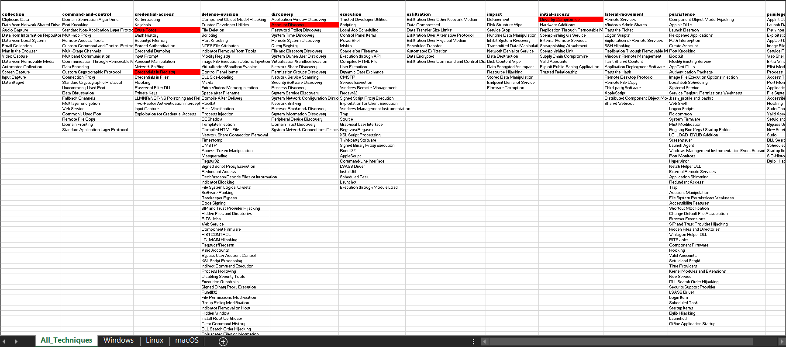

# Tanium_Mitre_Heat_Map
A Python script that utilizes the Tanium REST API to gather a list of IOC names from Tanium Threat response.  Assuming the IOC naming convention contains Mitre Technique ID and OS platform, the scripts finds and extracts the names that contain this information and compares it to the Technique IDs extracted from the Mitre Taxii feed.  The Mitre Taxii feed is used to recreate the Att&ck matrix in Excel, then based on the comparison from the IOC names extracted from Tanium, the Technique names are colored in heat map style to indicate coverage for the Mitre Technique.  The first Excel tab shows coverage for all Techniques, with the remaining tabs broken out by OS platform specific coverage.

This is useful to show return on investment as Mitre Technique coverage is added over time, utilizing Tanium supported IOC formats.  The goal of the script was to automate this metric creation. 

The script uses fernet encryption to protect the credentials, separating the key from the ciphertext. There is also a python script included for taking your base64 encoded password and generating a fernet key with ciphertext file.

This script also uses a 3 level deep list of lists.  A list for holding all data, a list for each Kill Chain phase, and a list for each Technique (containing Technique ID and name).

Many thanks to the python community for all the online tutorials, whose code has been borrowed/modified to make this possible.

